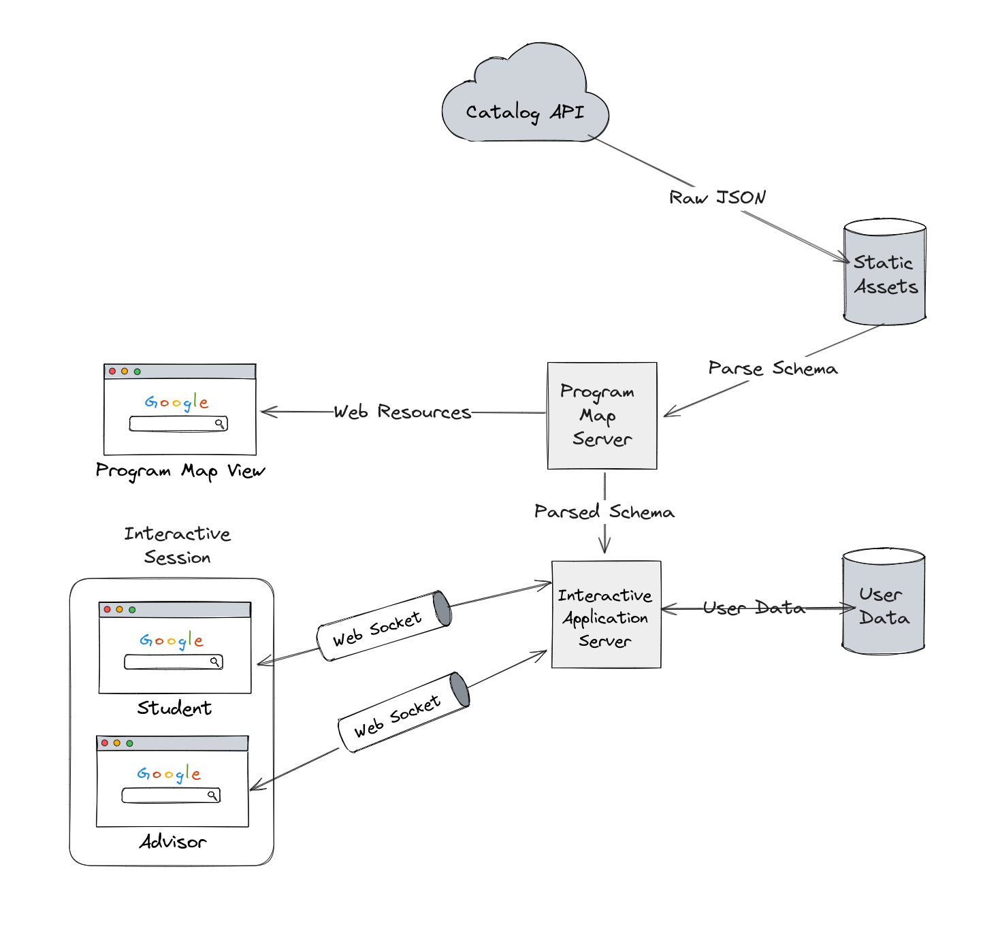

# VISLOG (Catalog Visualization)

Vislog is a project to visualize the Union University Catalog

## Architecture



### Backend

#### JSON Processing


- Manual trigger / API endpoint
- Gets triggered annually
- Manual trigger / timer

#### Static Asset Server

- Home page
- Program graphs and course relationships

#### Static Asset Storage

- Parsed schema
- Generated program visualizations

#### Interactive Server

- Maintain web socket connections between sessions
- Reads program information from the `static asset server`
- Authentication with Union's SSO / Azure Active Directory

#### User Data Storage

- User data
- Student id for identification
- Could be blob storage storing user data as files
- JSON or binary files

### Frontend

#### Static Site

- Display home page
- Display generated program visualizations
- Combine with interactive client?
  - Can reduce system complexity
  - Combines static server with interactive server (Seperation of concerns?)

#### Interactive Clients

- Interactive planning for program progression
- Planning by semesters
- Real time collaboration between student and advisor
- Show sessions of courses available? (Depending on the data provided by IT)
- Search bar for allowing to arbitrarily select courses not already selected in
  program map to compensate for the parts of the catalog that cannot be parsed

## Installation

Ensure that you have the latest version of npm and the rust toolchain installed (instructions vary based on your OS)

Clone the main branch of the following git repositories:

- Frontend: <https://github.com/sunkit02/vislog-front-ts>
- Backend: <https://github.com/UUCompSci/vislog>

### Build Steps

Run the following commands in the project root of the respective repos.

#### Frontend

Install all packages needed for the frontend.

```
npm install
```

Install all packages needed for the frontend.

```
npm run build
```

Keep note of the `{project-root}/dist` directory that contains the output of the build

#### Backend

Enter the directory of the vislog-server subcrate (we are building the server)

```
cd vislog-server
```

Compile the server (build in release mode with optimizations)

```
cargo build -r
```

Keep note of the executable located at `{project-root}/target/release` called `vislog-server(.exe)` (You may or may not have the .exe extension based on your OS)

### Configure the project (aka. Put the pieces in the right place)

1. Find a directory where you want to install the server to. We’ll call it `target-dir` from now on
2. Copy the `vislog-server(.exe)` executable to `target-dir`
3. Copy the entire `dist` directory from the frontend build to `target-dir`
4. Copy the `{vislog-repo-root-dir}/vislog-server/default-configs.toml` to `target-dir` and rename it to `vislog-configs.toml`
5. Run the `vislog-server(.exe)` executable
6. Open your browser of choice (preferably Chromium, I did not test any other ones) and go to the following URL: <http://127.0.0.1:8080>
